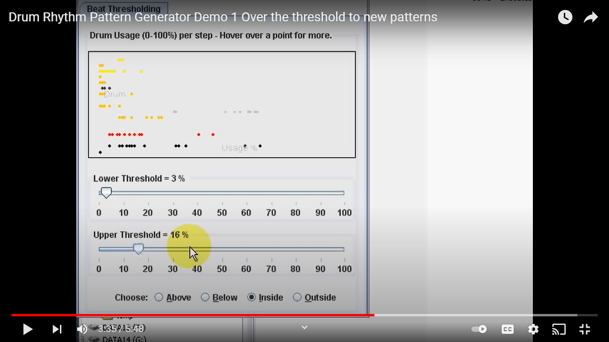
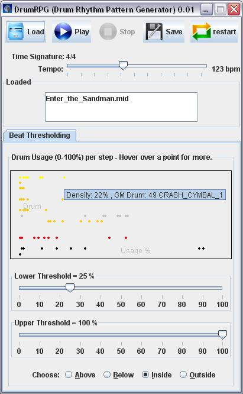

# Drum Rhythm Pattern Generator

Note: There is a demonstration of DrumRPG at: 

https://www.youtube.com/watch?v=zUD9FuKuzeg

**Table of Contents**
1. Pre-requisites
2. Downloading and Installing
3. Running
4. Example Sessions
5. Known Problems

*Note: GitHub has a full table of contents with links in the header icon (top left of the readme.md).*

## Pre-requisites
I'm assuming you already have a computer with Java 5 (or later) installed:

Windows: start > Run... > cmd

then type: java -version
e.g. expect : java version "1.6.0_05...".

If Java is not installed then download and install Java from http://java.com/en/download/manual.jsp
e.g. Windows XP/Vista/2000/2003 Offline * filesize: 15.18 MB

Mac: OS X includes the full version of Java 2SE 1.5. Go > Utilities > Terminal, then type:

java -version

## Downloading and Installing
Terms and Conditions: ALL INFORMATION AND CONTENT IS PROVIDED ON AN "AS IS" BASIS. IN NO EVENT WILL I BE LIABLE TO ANY PARTY FOR ANY DIRECT, INDIRECT, SPECIAL OR OTHER CONSEQUENTIAL DAMAGES.

DrumRPG is provided free and is provided open source under the GNU General Public License (GPL) .

Windows/Mac/Linux: download DrumRPG.jar

Source code: DrumRPGSource.jar

Example MIDI file from demo session: demo0_01.mid

## Credits
DrumRPG uses:

the jMusic Java music programming library (License: GPL)

RealistiK Reloaded icons (License: GPL) from opendesktop.org.

## Running
Double click on DrumRPG.jar

Expect the "DrumRPG" window to display and prompt you to "Choose a MIDI file". After a successful "Load" expect something like this::

## Example Sessions
Drum Rhythm Pattern Generator Demo 1 Over the threshold to new patterns

Hi welcome to the Drum Rhythm Pattern Generator version 0.01 demo video.

https://www.youtube.com/watch?v=zUD9FuKuzeg

This shows you how to generate new main and fill drum patterns from existing MIDI files. DrumRPG is provided free and is open source. It uses the jMusic Java music programming library.

Firstly have you got Java 5 or later installed? Check this by Start, Run, cmd, java -version. If not google java download and install a Java Runtime Environment (JRE) . Now to run the program, double click on DrumRPG.jar. Choose a type 1 midi file with drums on channel 10. Google midi files to find some, for example Enter the Sandman.

The drum track is analysed and a graph plot is displayed of the Drum Usage percentages for the bar steps per Drum. Hover over a point for more information. Black dots are Bass drum beats (in the General MIDI drum map), red for snares, grey for hi-hats, orange for Toms, yellow for cymbals etc.

Click Play to play a pattern generated using the current settings. The playback loops with a rest bar between repeats.Here it selects drum beats that occur between 25% and 100% of the time the main pattern used in the loaded file.If I select drum beats that occur Below 1% of the time, we get a drum fill instead. Lets click Stop.

Now to create some more novel patterns, let's Load another file (Tom Sawyer). As long as the time signature is the same as the first file loaded, the Drum Usage is calculated and added to current data. Now if we select Inside 16% to 39%, we get a new hybrid drum pattern derived from the data from Enter the Sandman and Tom Sawyer. Let's Save that to EnterTom16_39.mid so we can use that later as a repeating pattern in a MIDI sequencer.

OK, now let's look for a suitable fill to go with the pattern we've just saved, Select 3% to 6% and Save as EnterTom03_06.mid

For a bit more inspiration load a third file, Won't Get Fooled Again. Select 23% - 36% and Save as EnterTomWont23_36.mid. For a fill select 10% - 22% and save as EnterTomWont10_22.mid.

So to conclude this demo, the Drum Rhythm Pattern Generator was used to generate two new main and fill drum patterns from three existing MIDI files.

Drum Rhythm Pattern Generator Demo 2 using saved files in a sequencer

https://m.youtube.com/watch?v=g74vu_NUh0g

This video shows you how use main and fill drum patterns generated by DrumRPG by importing them into a MIDI sequencer.

Start a MIDI sequencer for example Cubase.

Select File, Import MIDI file, select a drum pattern, let's start with the fill EnterTom03_06.mid., OK,

Select the MIDI output device.

Then import a main pattern EnterTom16_39.mid. Edit Copy (Cltrl+C) and Paste (Ctrl+V) the pattern to repeat as desired, e.g. three times.

Remove any extra tracks created.

So if that's the drums for the verse, let's try the second pattern for the pre-chorus fill import MIDI file EnterTomWont10_22.mid.

And for the main Chorus pattern import MIDI file EnterTomWont23_36.mid.

As the drum patterns were generated at different tempos, I'll open the Project tempo Track and delete any tempo changes imported at the beginning.

Now return to the beginning of the track and play the drum sequence.

So to conclude this demo, a MIDI sequencer was used to string together patterns generated by DrumRPG to form a drum track for a new composition.

Note: I used Cubase LE, later versions of Cubase (e.g. Cubase 4) support dragging and dropping midi files Select File > Preferences, ensure the following options under MIDI files are deselected: “Auto Dissolve Format 0″ and “Import To Instrument Tracks”.

## Known Problems
MIDI playback may stop while looping, need to restart to get midi playback, seen on sun 1.6.0_07 seems to be more reliable with Sun Java 5: http://java.sun.com/javase/downloads/index_jdk5.jsp Java Runtime Environment (JRE) 5.0 Update 17

Occasional exception (does not crash program) when click “Stop” : Cycle-playing Drum Exception in thread "AWT-EventQueue-0" java.lang.NullPointerException at jm.midi.MidiSynth.stop(MidiSynth.java:183)

Playback timing can be off on some soundcards e.g. SoundMAX, timing OK on Soundblaster Audigy.

